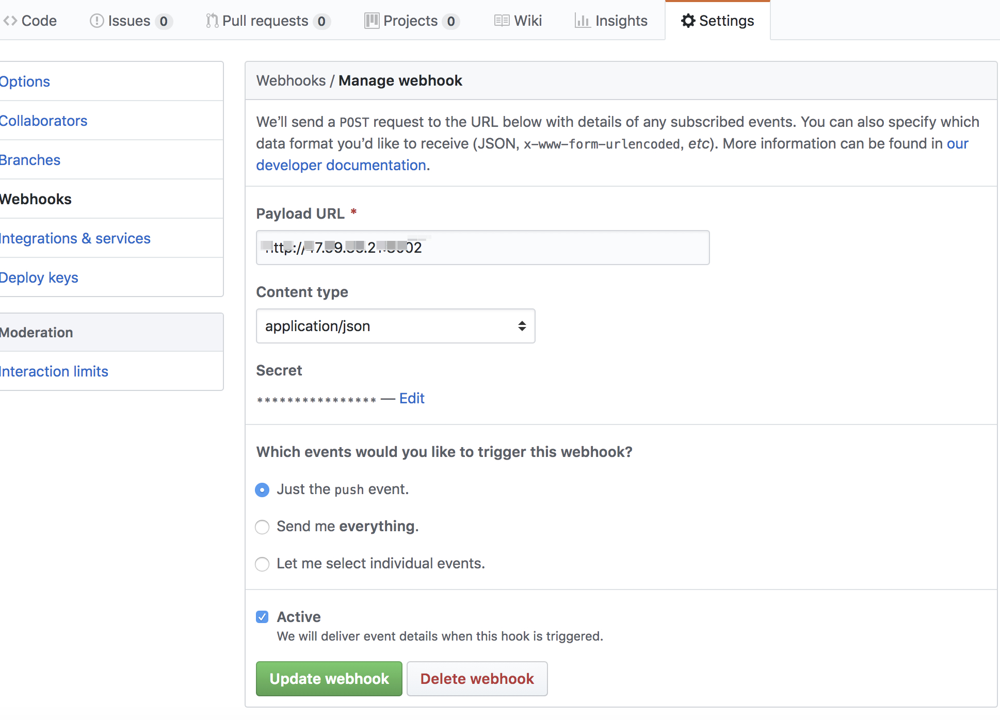

### webhook

### 使用webhook在linux上自动部署项目

每次从本地push代码到github后，还要在服务器上执行 `git pull`和后续的build命令等等
配置webhook后，可以实现本地push代码后，由github向我们提供的`payload URL` post请求

### 配置payload url


我们收到对应请求后可以实现自己的逻辑

### server服务使用的是[`@octokit/webhooks`](https://www.npmjs.com/package/@octokit/webhooks)

server.js


```
const WebhooksApi = require('@octokit/webhooks')
const { spawn } = require('child_process')

const webhooks = new WebhooksApi({
    secret: 'jiangbo' //github webhooks 配置页面设置的secret
})

webhooks.on('*', ({ id, name, payload }) => {
    if (name === 'push') {
        var ls = spawn('sh', ['./deploy.sh'])
        ls.stdout.on('data', (data) => {
            console.log(`输出：${data}`)
        });

        ls.stderr.on('data', (data) => {
            console.log(`错误：${data}`)
        })
    }
})

require('http').createServer(webhooks.middleware).listen(8002)
```